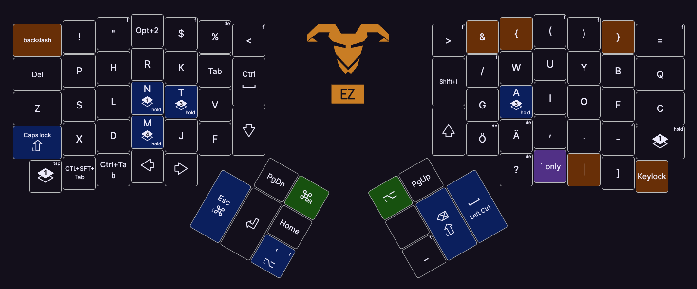

# My dotfiles

This is the configuration for my personal development environment.

I use this repository to

- explain and share ideas with others
- share the configuration between my machines
- keep track of the changes I make to my configuration

## Keyboard

My keyboard is an [ErgoDox EZ](https://ergodox-ez.com/). It is a split keyboard
with mechanical switches.

## Keyboard layout



My keyboard layout is based on
[DAS](https://web.archive.org/web/20231108015515/https://c.seres.fi/das), a
layout optimized for the Finnish language created by Cristian Seres.

The layout and all its customizations are embedded in the keyboard's firmware
using [QMK](https://qmk.fm/).

## Installation

Because this is a personal configuration, it is not meant to be installed by
others. However, you can use it as a reference for your own configuration.

Here are the basics:

### Dotfile management

I manage my dotfiles with GNU Stow. It creates symlinks from the repository to
the home directory. See
[here](https://dev.to/spacerockmedia/how-i-manage-my-dotfiles-using-gnu-stow-4l59)
for an introduction by Shawn McElroy.

This way I can keep the configuration under version control and still have it in
the home directory.

```sh
# Sync the dotfiles (practice run)
stow --verbose 2 . --simulate

# Really sync the dotfiles
stow --verbose 2 .
```

### Testing

Instead of managing an installation script, I have a test that I can run in
neovim.

The test checks that I have all the applications installed, and acts as a
reminder.

```vim
" in neovim
:checkhealth
```

#### Continuous integration

I have an end-to-end testing setup in [integration-tests](./integration-tests).
It uses <https://github.com/mikavilpas/tui-sandbox> to run the tests.

### Formatting

Here is how the files in this repository are formatted. Since I am the only
maintainer, most use the editor's "format on save" functionality.

| Filetype | Formatter                                 | Notes                   |
| -------- | ----------------------------------------- | ----------------------- |
| Markdown | [prettier](https://prettier.io/)          |                         |
| TOML     | [taplo](https://github.com/tamasfe/taplo) | Run with `taplo format` |
